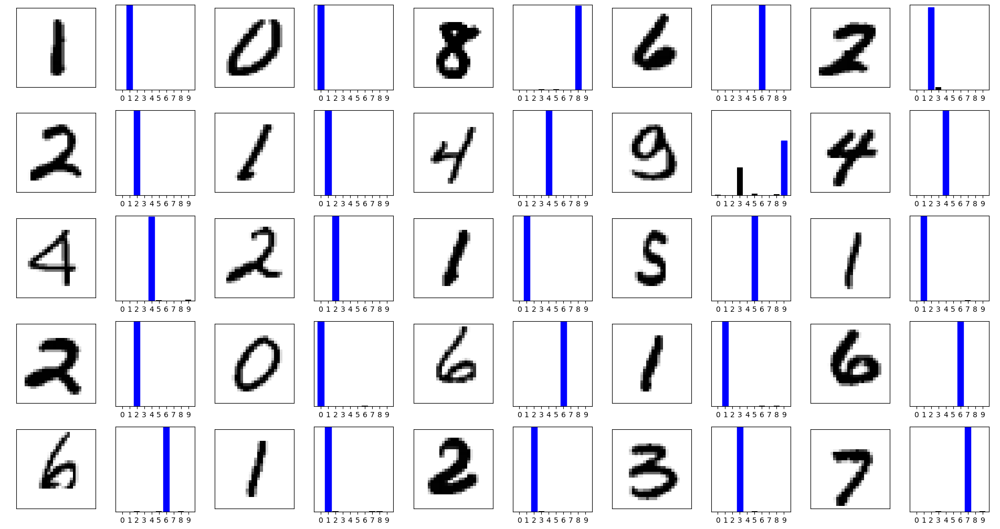

A very basic neural network prediction model using the digit MNIST dataset



## Preface
I roughly read this [example](https://www.tensorflow.org/tutorials/keras/classification) and modified each step to conform to the digit MNIST dataset.
Notable network modifications are:
* reduction in neuron count in the intermediate layer as we are not dealing with the complexity of clothing items
* reduction in epoch count for equal reasons

Anyways, a 128 neuron model using 10 epochs of training has a marginal difference in accuracy of ~0.02%.  
The model could probably be further optimized to a lower neuron count, and have a small impact - we are only dealing with digits from zero to nine.

## Usage
Simply execute the `main.py` script:
```
python main.py
```

The program saves and hot-loads a model to save time upon the next usage of the script
